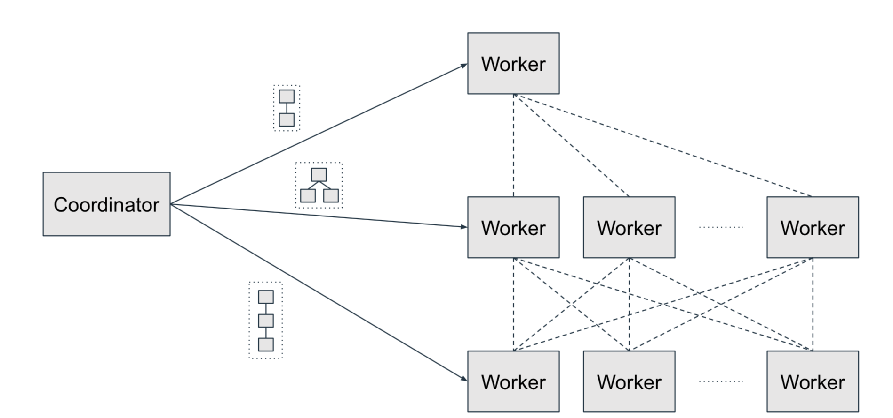

## Presto任务调度

网上有很多关于MR、Spark的任务调度讨论，Presto的相关介绍却很少。本文抛砖引玉，希望大家一起讨论Presto的任务调度的设计与实现

## 相关概念

### Query

对应提交的一条SQL查询语句，由QueryScheduler负责调度。

### Stage

QueryScheduler会将Query Plan划分成多个Stage。包含Leaf State和Immediate Stage两类。

Presto为了提高查询的效率，默认会让集群中所有的worker节点都会参与leaf stage阶段的任务，因为查询中数据读取的解压/解码过程是最耗时的，但如果数据源是shared nothing类型的，数据读取任务只会下发到数据结点。对于immediate stage，presto会选择一部分worker参与计算。

stage由StageScheduler负责调度。stage的调度有两种策略:
- all-at-once: 直接将所有的stage的任务下发到worker，形成数据处理的拓扑图。这种调度策略适合adhoc类要求响应快的场景。
- phased: 先将有循环依赖的stage合成一个结点，得到有向无环图，然后根据任意的拓扑排序调度。这种策略适合etl类对资源敏感，需要长时间运行的场景。

### Task/Pipeline
StageScheduler会将stage衍生成多个并行执行的task任务。task下发到worker后，由TaskScheduler负责调度。

调度逻辑不同于spark，spark是将每个task任务运行结束后再执行下一个task，task执行过程中占用一个线程。而presto会将task分成多个pipeline，由driver执行。pipeline的调度过程有点类似于**操作系统的进程调度，任务每次只处理一个page**，执行中可能由于资源不到位或者数据未就绪而被block，从而可以在每个operator中退出。处理完一个page后被放回任务队列等待下次时间片。
这种更细粒度的调度可以使得每个查询都得到充分的执行，所以官方推荐中说明可以通过增加cpu的方式减少查询延迟。

另外，这种presto会统计task每次执行的时长，将运行时间长的任务划分到低优先级，时间少的划到高优化级，从而保证了快得到更多的资源，因为presto认为查询用时越少的任务优先级越高。

### Split
类似MR/spark中的split，presto也是将表或者分区分成成多个split。但presto在调度split时，是动态将split下发到driver的任务队列中，下发过程会根据driver的负载动态调整，可以解决某些查询的数据倾斜问题。

