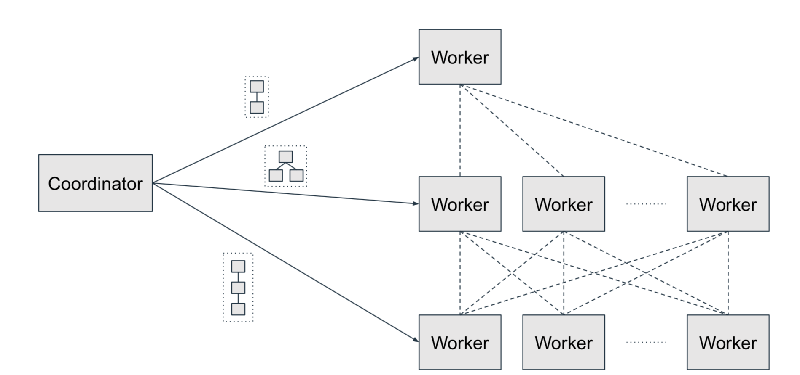

## Presto任务调度

网上有很多关于MR、Spark的任务调度讨论，Presto的相关介绍却很少. 本文抛砖引玉，希望大家一起讨论Presto的任务调度的设计与实现

## 相关概念

下图中，虚线包围的方块代表SubPlan，其中的方块代表Operator。


### Query

对应提交的一条SQL查询语句，同级概念实体有DAG, QueryScheduler

### Stage

QueryScheduler会将QueryPlan划分成多个Stage。分成Leaf State和Immediate Stage两类。

### Task

### Markdown

Markdown is a lightweight and easy-to-use syntax for styling your writing. It includes conventions for

```markdown
Syntax highlighted code block

# Header 1
## Header 2
### Header 3

- Bulleted
- List

1. Numbered
2. List

**Bold** and _Italic_ and `Code` text

[Link](url) and 
```

For more details see [GitHub Flavored Markdown](https://guides.github.com/features/mastering-markdown/).

### Jekyll Themes

Your Pages site will use the layout and styles from the Jekyll theme you have selected in your [repository settings](https://github.com/hqx871/olaptalk/settings). The name of this theme is saved in the Jekyll `_config.yml` configuration file.

### Support or Contact

Having trouble with Pages? Check out our [documentation](https://docs.github.com/categories/github-pages-basics/) or [contact support](https://support.github.com/contact) and we’ll help you sort it out.
