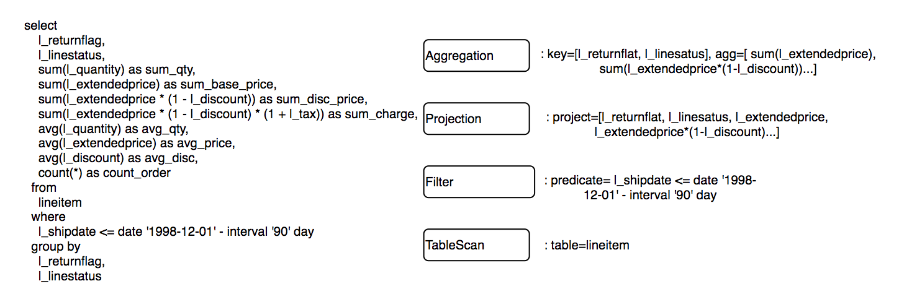
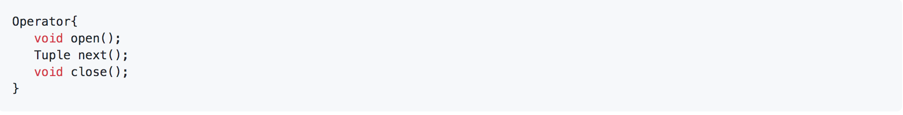
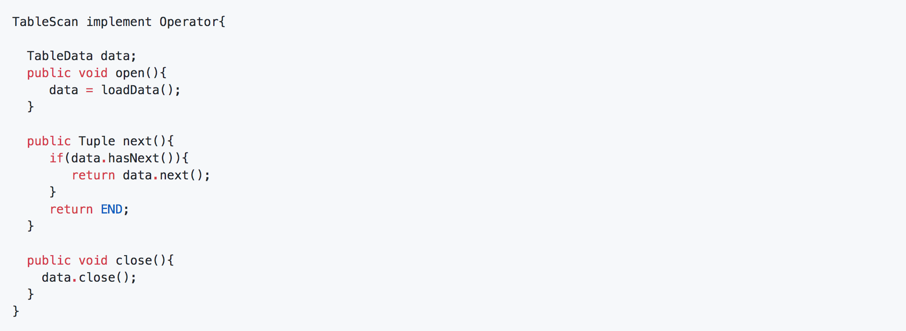
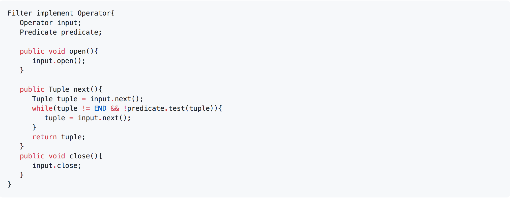
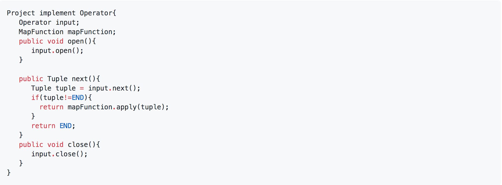
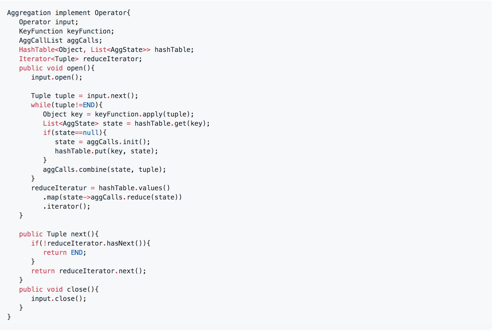
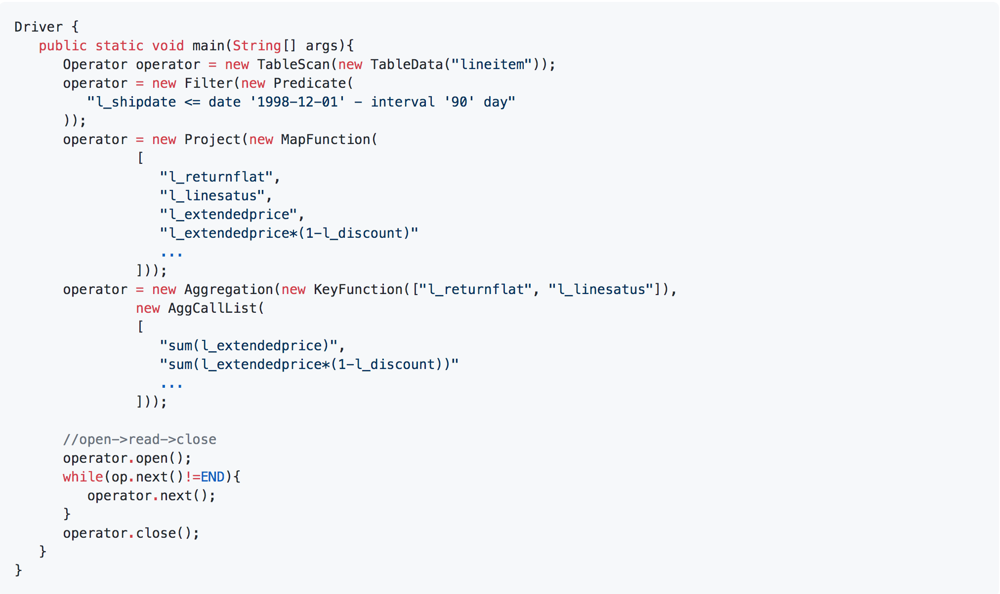

## Volcano查询处理模型

volcano是最经典的数据查询处理模型，许多数据库如mysql等都是基于volcano模型。

### 执行计划

图中左边的查询语句被翻译成了右边的执行计划。下面根据些简单说明volcano模型设计与实现

### Operator算子抽象

volcano的所有算子都是包含open/next/close三个方法。
- open 用于资源初始化操作
- next 获取下一行
- close 释放资源

### TableScan

### Filter

### Projection

### Aggregation

### Driver

